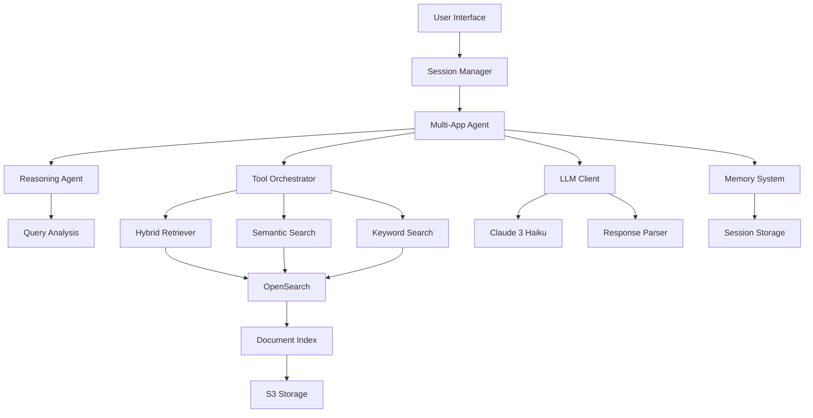

# 🚀 RAG Multi-Application System v3

[](https://www.python.org/downloads/)
[](https://aws.amazon.com/)
[](https://opensource.org/licenses/MIT)

## 📋 Overview

**RAG Multi-Application System v3** is an enterprise-grade Retrieval-Augmented Generation (RAG) platform designed to support multiple business applications with advanced conversational AI capabilities. The system provides isolated, session-aware chat interfaces for different enterprise systems while maintaining high performance and scalability.

### 🎯 Key Features

- **🏢 Multi-Application Support**: Isolated environments for different enterprise systems (SAP, DARWIN, GADEA, PDS)
- **👥 Session Management**: Concurrent user sessions with conversation memory isolation
- **🔍 Advanced Search**: Hybrid search combining vector similarity and keyword matching with RRF (Reciprocal Rank Fusion)
- **🤖 AI-Powered Responses**: Claude 3 Haiku integration with structured JSON responses and confidence scoring
- **📚 Multimodal Support**: Text and image processing with intelligent fallback mechanisms
- **🧠 Conversational Memory**: Advanced memory system with context-aware conversation tracking
- **📊 Real-time Analytics**: Comprehensive response analysis with confidence factors and source attribution

## 🏗️ Architecture

### System Components



### 📱 Supported Applications

| Application | Description | Use Case |
|-------------|-------------|----------|
| **SAP** | Enterprise ERP System | Financial, HR, and operational queries |
| **DARWIN** | Business Management Platform | Process management and workflow queries |
| **GADEA** | Enterprise Management System | Business operations and analytics |
| **PDS** | Digital Services Platform | Service management and customer support |

## 🛠️ Technology Stack

### Core Technologies
- **Python 3.8+** - Primary development language
- **AWS Bedrock** - AI/ML services (Claude 3 Haiku, Titan Embeddings)
- **Amazon OpenSearch** - Vector and text search engine
- **PostgreSQL** - Relational database for metadata
- **AWS S3** - Document storage and versioning

### Key Libraries
- **boto3** - AWS SDK for Python
- **opensearch-py** - OpenSearch client
- **PyMuPDF** - PDF processing
- **python-docx** - Word document processing
- **Pillow** - Image processing
- **pandas** - Data manipulation
- **numpy** - Numerical computing

## 📁 Project Structure

```
RAG_SYSTEM_MULTI_v3/
├── 📂 src/                          # Core source code
│   ├── 📂 agent/                    # Conversational agents
│   │   ├── advanced_conversational_agent.py
│   │   ├── advanced_memory.py
│   │   ├── reasoning_agent_fixed.py
│   │   ├── session_manager.py
│   │   └── tool_orchestrator.py
│   ├── 📂 generation/               # Response generation
│   │   ├── llm_client_fixed.py
│   │   ├── citation_manager_fixed.py
│   │   ├── structured_response_parser.py
│   │   └── image_summary_retriever.py
│   ├── 📂 retrieval/                # Search and retrieval
│   │   ├── hybrid_retriever_fixed.py
│   │   └── specialized_retrievers.py
│   ├── 📂 indexing/                 # Document indexing
│   │   ├── multi_app_opensearch_indexer.py
│   │   └── semantic_chunker.py
│   ├── 📂 ingestion/                # Document processing
│   │   └── document_loader.py
│   └── 📂 utils/                    # Utilities
│       ├── multi_app_config_manager.py
│       └── connection_manager.py
├── 📂 config/                       # Configuration files
│   ├── multi_app_config.yaml       # Main configuration
│   └── 📂 system_prompts/           # AI system prompts
├── 📂 scripts/                      # Executable scripts
│   ├── multi_app_chat_with_sessions.py
│   ├── multi_app_aws_ingestion_manager_with_summarization.py
│   └── opensearch_chunk_analyzer.py
├── 📂 data/                         # Data storage
│   └── 📂 memory/                   # Session memory files
├── 📂 logs/                         # System logs
├── requirements.txt                 # Python dependencies
└── README.md                        # This file
```

## ⚙️ Installation & Setup

### Prerequisites

- **Python 3.8+**
- **AWS Account** with appropriate permissions
- **AWS CLI** configured
- **Git**

### 1. Clone Repository

```bash
git clone https://github.com/carlossarrion-wq/rag-system-multi-v2.git
cd RAG_SYSTEM_MULTI_v3
```

### 2. Install Dependencies

```bash
# Create virtual environment (recommended)
python3 -m venv venv
source venv/bin/activate  # On Windows: venv\Scripts\activate

# Install requirements
pip3 install -r requirements.txt
```

### 3. Configure AWS Services

#### Set up AWS credentials:
```bash
aws configure
# Enter your AWS Access Key ID, Secret Access Key, and region (eu-west-1)
```

#### Required AWS Services:
- **Amazon Bedrock** - Enable Claude 3 Haiku and Titan Embeddings models
- **Amazon OpenSearch** - Create domain with VPC access
- **Amazon S3** - Create buckets for each application
- **Amazon RDS PostgreSQL** - Create database instance

### 4. Environment Configuration

Create `.env` file:
```bash
# AWS Configuration
AWS_REGION=eu-west-1
AWS_PROFILE=default

# OpenSearch
OPENSEARCH_ENDPOINT=vpc-rag-opensearch-clean-xxx.eu-west-1.es.amazonaws.com

# PostgreSQL
POSTGRES_HOST=rag-postgres.xxx.eu-west-1.rds.amazonaws.com
POSTGRES_PORT=5432
POSTGRES_DB=ragdb
POSTGRES_USER=raguser
POSTGRES_PASSWORD=your_password
```

### 5. Configure Applications

Edit `config/multi_app_config.yaml` to match your AWS resources:

```yaml
applications:
  sap:
    s3:
      bucket: "your-rag-system-sap-bucket"
    opensearch:
      index_name: "rag-documents-sap"
  # ... other applications
```

## 🚀 Usage

### Document Ingestion

Ingest documents into the system for a specific application:

```bash
# Ingest documents for SAP application
python3 scripts/multi_app_aws_ingestion_manager_with_summarization.py --app sap

# Options:
# --dry-run          # Preview changes without executing
# --enable-summarization  # Generate document summaries (default: true)
# --path <s3_path>   # Specific S3 path to process
```

### Interactive Chat Interface

Start a conversational session:

```bash
# Start chat for SAP application with user session
python3 scripts/multi_app_chat_with_sessions.py --app sap --user john_doe

# Options:
# --session <session_id>  # Resume existing session
# --max-results 10        # Maximum search results (default: 8)
# --list-apps            # List available applications
# --session-stats        # Show session statistics
```

### Chat Commands

Once in the chat interface, you can use these commands:

| Command | Description |
|---------|-------------|
| `help` | Show available commands |
| `quit`, `exit`, `bye` | End conversation |
| `switch <app_name>` | Switch to different application |
| `session info` | Show current session information |
| `session list` | List your sessions |
| `session switch <session_id>` | Switch to different session |
| `session stats` | Show global session statistics |
| `apps` | List available applications |

### System Analysis

Analyze document chunks and search performance:

```bash
# Analyze OpenSearch chunks for optimization
python3 scripts/opensearch_chunk_analyzer.py --app sap

# Check document summaries
python3 scripts/check_summaries.py --app sap
```

## 📊 Features Deep Dive

### 🔍 Advanced Search Capabilities

#### Hybrid Search
- **Vector Search**: Semantic similarity using Titan embeddings
- **Keyword Search**: Traditional text matching with BM25
- **RRF Fusion**: Combines results using Reciprocal Rank Fusion algorithm

#### Search Strategies
- **Single Stage**: Direct search with one tool
- **Multi Stage**: Sequential search with multiple tools
- **Comparative**: Parallel search with query variations
- **Exploratory**: Diverse search for broad topics

### 🧠 Intelligent Memory System

#### Session Management
- **Isolated Sessions**: Each user maintains separate conversation history
- **Context Preservation**: Maintains conversation context across interactions
- **Memory Optimization**: Automatic cleanup of old sessions

#### Memory Features
- **Short-term Memory**: Recent conversation turns (10 turns)
- **Long-term Memory**: Important conversation history (100 turns)
- **Entity Extraction**: Identifies and tracks important entities
- **Topic Modeling**: Understands conversation themes

### 🤖 AI Response Generation

#### Claude 3 Haiku Integration
- **Structured Responses**: JSON-formatted responses with metadata
- **Confidence Scoring**: Multi-factor confidence assessment
- **Source Attribution**: Detailed citation and source tracking
- **Context Optimization**: Intelligent context window management

#### Response Features
- **Key Points Extraction**: Highlights important information
- **Follow-up Questions**: Suggests relevant next questions
- **Related Topics**: Identifies connected subjects
- **Warning Detection**: Flags potential issues or limitations

### 📚 Multimodal Document Processing

#### Supported Formats
- **Text**: PDF, DOCX, TXT, XML
- **Images**: PNG, JPG, JPEG with OCR capabilities
- **Spreadsheets**: XLSX with table preservation
- **Structured Data**: XML with metadata extraction

#### Processing Features
- **Semantic Chunking**: Intelligent text segmentation
- **Table Preservation**: Maintains table structure and context
- **Image Analysis**: Extracts text and generates descriptions
- **Metadata Enrichment**: Adds technical codes and content classification

## 🔧 Configuration

### Application Configuration

Each application in `config/multi_app_config.yaml` supports:

```yaml
applications:
  your_app:
    name: "Your Application Name"
    description: "Application description"
    
    # Storage configuration
    s3:
      bucket: "your-app-bucket"
      documents_prefix: "applications/your_app/documents/"
      
    # Search configuration
    opensearch:
      index_name: "rag-documents-your-app"
      
    # RAG system settings
    rag_system:
      chunking:
        chunk_size: 1500
        chunk_overlap: 225
      search:
        similarity_threshold: 0.75
        max_results: 8
        hybrid_search: true
      generation:
        context_window: 3000
        max_response_tokens: 1000
        
    # Custom AI behavior
    system_prompt_file: "system_prompts/your_app_system_prompt.json"
```

### Performance Tuning

#### Search Optimization
- **Chunk Size**: Adjust based on document types (1000-2000 tokens)
- **Overlap**: Configure overlap for context preservation (15-20% of chunk size)
- **Similarity Threshold**: Fine-tune relevance filtering (0.7-0.8)

#### Memory Management
- **Session Timeout**: Configure session expiration (24 hours default)
- **Memory Limits**: Set conversation history limits
- **Cleanup Frequency**: Automatic cleanup intervals

## 📈 Monitoring & Analytics

### System Metrics

The system provides comprehensive analytics:

#### Response Quality Metrics
- **Confidence Scores**: Multi-factor confidence assessment
- **Source Quality**: Relevance and reliability scoring
- **Response Time**: End-to-end processing time
- **Cache Hit Rates**: Context caching effectiveness

#### Usage Analytics
- **Session Statistics**: Active sessions by application and user
- **Query Patterns**: Most common query types and topics
- **Document Usage**: Most referenced documents and sources
- **Error Rates**: System reliability metrics

### Logging

Comprehensive logging system:

```bash
# Log locations
logs/rag_system.log          # Main system log
logs/llm_complete_dump_*.txt # Detailed LLM interactions
data/memory/                 # Session memory files
```

## 🔒 Security & Privacy

### Data Protection
- **Session Isolation**: Complete separation between user sessions
- **Encrypted Storage**: All data encrypted at rest and in transit
- **Access Control**: AWS IAM-based permissions
- **Audit Logging**: Comprehensive activity logging

### Privacy Features
- **Anonymous Sessions**: Support for anonymous users
- **Data Retention**: Configurable data retention policies
- **GDPR Compliance**: Data deletion and export capabilities

## 🚨 Troubleshooting

### Common Issues

#### Connection Problems
```bash
# Test AWS connectivity
aws sts get-caller-identity

# Test OpenSearch connection
curl -X GET "https://your-opensearch-endpoint/_cluster/health"

# Test S3 access
aws s3 ls s3://your-bucket-name
```

#### Performance Issues
```bash
# Analyze chunk distribution
python3 scripts/opensearch_chunk_analyzer.py --app your_app

# Check memory usage
python3 -c "
import psutil
print(f'Memory: {psutil.virtual_memory().percent}%')
print(f'CPU: {psutil.cpu_percent()}%')
"
```

#### Session Issues
```bash
# Clean up expired sessions
python3 scripts/multi_app_chat_with_sessions.py --cleanup-sessions

# Check session statistics
python3 scripts/multi_app_chat_with_sessions.py --session-stats
```

### Error Codes

| Error Code | Description | Solution |
|------------|-------------|----------|
| `AWS_AUTH_ERROR` | AWS authentication failed | Check AWS credentials and permissions |
| `OPENSEARCH_CONNECTION_ERROR` | Cannot connect to OpenSearch | Verify endpoint and VPC configuration |
| `SESSION_EXPIRED` | User session has expired | Create new session or extend timeout |
| `DOCUMENT_NOT_FOUND` | Referenced document missing | Re-run document ingestion |
| `LLM_RATE_LIMIT` | Bedrock rate limit exceeded | Implement exponential backoff |

## 🔄 Maintenance

### Regular Maintenance Tasks

#### Daily
- Monitor system logs for errors
- Check session statistics
- Verify document ingestion status

#### Weekly
- Clean up expired sessions
- Analyze performance metrics
- Update document summaries if needed

#### Monthly
- Review and optimize search parameters
- Update system prompts based on usage patterns
- Backup configuration and critical data

### Updates and Upgrades

```bash
# Update dependencies
pip3 install -r requirements.txt --upgrade

# Update AWS CLI
pip3 install awscli --upgrade

# Check for system updates
git pull origin main
```

## 🤝 Contributing

We welcome contributions! Please follow these guidelines:

### Development Setup

```bash
# Clone repository
git clone https://github.com/carlossarrion-wq/rag-system-multi-v2.git
cd RAG_SYSTEM_MULTI_v3

# Create development branch
git checkout -b feature/your-feature-name

# Install development dependencies
pip3 install -r requirements.txt
pip3 install pytest black flake8  # Development tools
```

### Code Standards

- **Python Style**: Follow PEP 8 guidelines
- **Documentation**: Add docstrings to all functions and classes
- **Testing**: Include unit tests for new features
- **Type Hints**: Use type annotations where appropriate

### Pull Request Process

1. **Fork** the repository
2. **Create** a feature branch
3. **Make** your changes with tests
4. **Run** code quality checks:
   ```bash
   black src/ scripts/  # Format code
   flake8 src/ scripts/  # Check style
   pytest tests/        # Run tests
   ```
5. **Submit** pull request with detailed description

## 📄 License

This project is licensed under the MIT License - see the [LICENSE](LICENSE) file for details.

## 🆘 Support

### Getting Help

- **📖 Documentation**: Check this README and inline code documentation
- **🐛 Issues**: Create GitHub issues for bugs and feature requests
- **💬 Discussions**: Use GitHub Discussions for questions and ideas
- **📧 Contact**: Reach out to the development team

### Support Channels

| Channel | Purpose | Response Time |
|---------|---------|---------------|
| GitHub Issues | Bug reports, feature requests | 1-2 business days |
| GitHub Discussions | Questions, ideas, general help | 2-3 business days |
| Email | Security issues, private matters | 1 business day |

## 🎯 Roadmap

### Upcoming Features

#### Q1 2025
- [ ] **Advanced Analytics Dashboard** - Web-based monitoring interface
- [ ] **Multi-language Support** - Support for Spanish, French, German
- [ ] **API Gateway Integration** - RESTful API for external integrations
- [ ] **Enhanced Security** - OAuth2 and SAML integration

#### Q2 2025
- [ ] **Graph-based Search** - Knowledge graph integration
- [ ] **Real-time Collaboration** - Shared sessions and collaborative queries
- [ ] **Advanced Caching** - Redis-based caching layer
- [ ] **Mobile Support** - Mobile-optimized interface

#### Q3 2025
- [ ] **Custom Model Support** - Support for custom fine-tuned models
- [ ] **Workflow Integration** - Integration with business process tools
- [ ] **Advanced Analytics** - Predictive analytics and insights
- [ ] **Enterprise SSO** - Enterprise identity provider integration

---

## 📊 Project Statistics

- **Lines of Code**: ~15,000+
- **Supported File Formats**: 8+
- **AWS Services Integrated**: 6+
- **Applications Supported**: 4+
- **Languages**: Python, YAML, JSON
- **Architecture**: Microservices, Event-driven

---

**🚀 RAG Multi-Application System v3** - Empowering enterprise conversations with AI

*Last Updated: October 2024*
*Version: 3.0.0*
*Status: 🔄 Active Development*
